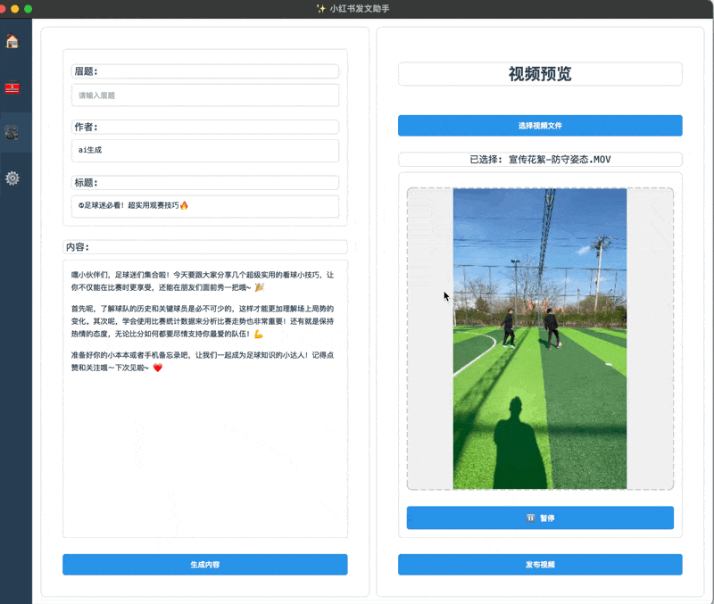

# 小红书发文助手

<div align="center">

[](https://www.python.org/downloads/)
[](LICENSE)
[](https://www.microsoft.com/windows)
[](https://github.com/yourusername/xhs_ai_publisher/releases)

[简体中文](./readme.md) | [English](./readme_en.md)

</div>

## ✨ 项目简介

`xhs_ai_publisher` 是一个基于 Python 的自动化工具，专为小红书平台内容创作者设计。该项目结合了图形用户界面与自动化脚本，利用大模型技术生成内容，并通过浏览器自动登录和发布文章，旨在简化内容创作与发布流程。



## 🚀 功能特点

- **智能内容生成**：利用大模型技术自动生成文章标题和内容
- **图片智能处理**：自动下载并预览封面图和内容图片
- **便捷登录**：支持手机号登录，自动保存登录凭证
- **一键发布**：支持文章预览和自动发布
- **用户友好界面**：简洁直观的图形界面操作
- **定时发布**：支持定时任务，自动发布文章

## 📁 项目结构

```
/XiaohongshuHelper
│
├── main.py                  # 主程序入口
├── requirements.txt         # 项目依赖文件
├── README.md                # 项目说明文档
│
├── /ui                      # 用户界面相关文件
│   ├── main_window.py       # 主窗口逻辑
│   ├── video_upload_page.py # 视频上传页面
│   ├── home_page.py         # 主页
│   ├── tools_page.py        # 工具页面
│   └── settings_page.py     # 设置页面
│
├── /api                     # API 相关逻辑
│   └── llama_api.py         # 调用本地 LLaMA 接口的逻辑
│
├── /utils                   # 工具函数
│   ├── logger.py            # 日志记录工具
│   └── helpers.py           # 其他辅助函数
│
└── /assets                  # 资源文件
    ├── styles.qss           # 样式表
    └── icons                # 图标文件
```

## 🛠️ 安装与使用

### 环境要求

- Python 3.12+
- Chrome 浏览器
- 其他依赖见 requirements.txt

## 📋 待办事项

- **内容库**：计划添加内容库功能，支持保存和管理多种类型的内容素材
- **模板库**：开发模板库系统，提供多种预设模板，方便快速创建不同风格的文章


### 安装步骤

1. **克隆项目**
```bash
git clone https://github.com/doing-cr7/redenote_publisher.git
cd redenote_publisher
```

2. **安装依赖**
```bash
pip install -r requirements.txt
```
3. **安装游览器依赖**
```bash
playwright install chromium
```
4. **运行程序**
```bash
python main.py
```

### 使用流程

1. 启动程序后，输入手机号登录小红书账户
2. 在标题编辑区设置文章标题和作者信息
3. 在内容输入区输入文章主题
4. 点击"生成内容"按钮生成文章
5. 预览生成的内容和配图
6. 确认无误后点击"预览发布"


## 📝 注意事项

- 确保已安装 Chrome 浏览器，并下载对应版本的 ChromeDriver
- 登录过程中需要输入验证码，请确保手机畅通
- 发布文章前，请核对生成的内容和图片，确保符合发布要求
- 建议定期备份登录凭证和配置文件

## 🤝 贡献指南

欢迎提交 Issue 和 Pull Request 来帮助改进项目。

## 📞 联系方式

### 我新建了一个群聊，如果有任何问题或者需求，都可以进群沟通


### 公众号(暂时没有)
<!--  -->

---   

<div align="center">
  <sub>Built with ❤️ for Xiaohongshu content creators</sub>
</div>
